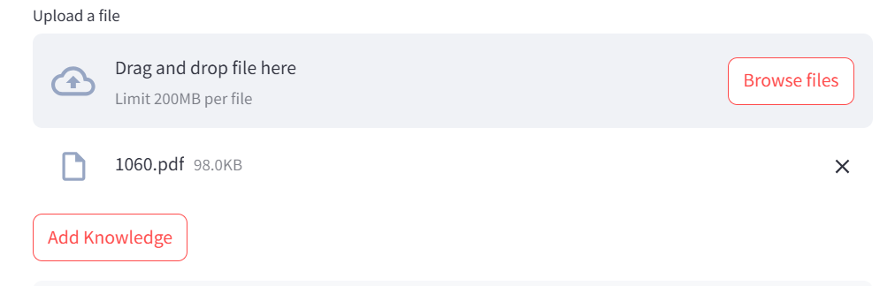

# **AWS RAG Chatbot**

This project creates a Retrieval-Augmented Generation (RAG) chatbot using **AWS AI services**, specifically **Amazon Bedrock**. It leverages **Knowledge Bases**, **Agents**, and integrates with a **Streamlit** application for seamless deployment. AWS **S3** and **IAM** services are utilized for file storage and permissions management. 

This solution builds on the RAG chatbot solution provided by [Aniket Wattamwar](https://www.youtube.com/watch?v=VGL6_k1DuDE) by adding automated ingestion capabilities, enabling dynamic syncing of data to the Knowledge Base. The chatbot can answer queries using the pre-existing Knowledge Base and allows users to add their own documents, which are automatically ingested for enhanced interactions.

---

## **Architecture Diagram**
This diagram provides a high-level view of the system architecture:


---

## **Features**
1. **Dynamic Knowledge Base Integration**:
   - Automatically syncs user-uploaded documents to the Knowledge Base using **Amazon Bedrock Agents**.
2. **Custom Document Support**:
   - Users can upload their own documents for ingestion, enabling queries on personalized data.
3. **Scalable and Secure**:
   - Uses **AWS IAM** for managing permissions.
   - Integrates with **Amazon OpenSearch** for vector-based document retrieval.
4. **User-Friendly Deployment**:
   - Deployed as an interactive chatbot using **Streamlit**.

---

## **Results**

### **Landing Page**
The landing page provides an intuitive interface, allowing users to chat with the bot or add their own documents:


### **Initial Knowledge Base Performance**
For testing, four documents about Mars travel were added to the Knowledge Base. The chatbot responded with high-quality, accurate answers:


### **Adding Your Own Knowledge**
The interface to upload documents for ingestion into the Knowledge Base:
  


### **Custom Document Integration**
A document containing personal information was added. After ingestion, the chatbot successfully responded with relevant answers based on the new data:


---

## **Execution Steps**

### **1. Set Up IAM User**  
Create an IAM user and attach the following permissions policies:  


### **2. Enable Access to Foundation Models**  
Ensure your IAM user has access to **Amazon Bedrock Foundation Models**.

### **3. Store Files in Amazon S3**  
Upload files to your S3 bucket for the Knowledge Base.

### **4. Create a Knowledge Base**  
Set up a Knowledge Base in **Amazon Bedrock** and integrate it with **Amazon OpenSearch Service** for vectorized data retrieval.

### **5. Run the Application**  
Execute the Streamlit application using the following command:  
```bash
streamlit run rag_chatbot_app.py
```

---

## **Technologies Used**
- **Amazon Bedrock**: Foundation Models, Knowledge Base, and Agent API.
- **Amazon OpenSearch**: Vector-based document retrieval.
- **Amazon S3**: Secure storage for Knowledge Base files.
- **AWS IAM**: Permissions management for secure access.
- **Streamlit**: Interactive user interface for the chatbot.

---

## **Acknowledgment**
This project is inspired by [Aniket Wattamwar's RAG chatbot solution](https://www.youtube.com/watch?v=VGL6_k1DuDE), with significant enhancements to include dynamic ingestion and user-friendly deployment.
